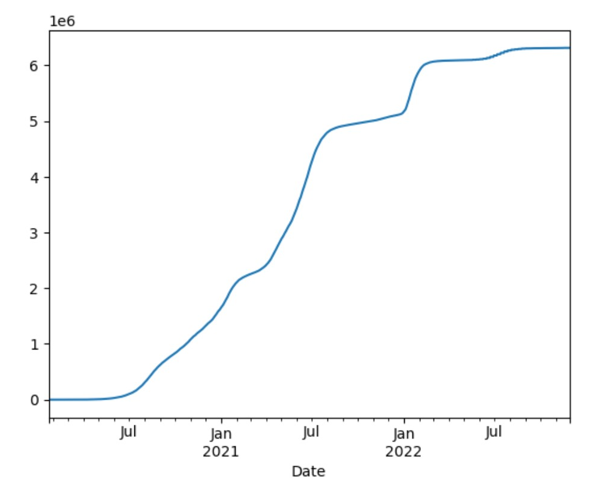
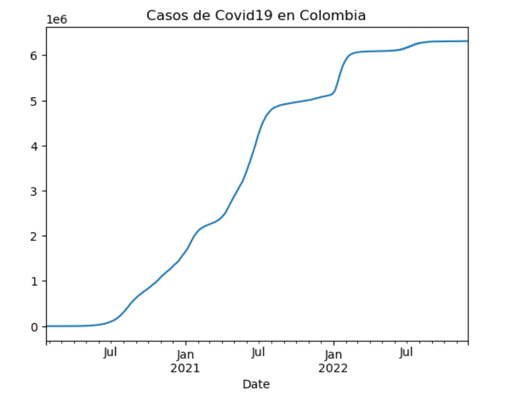

## Metodología
# Periodismo de Datos II: Herramientas Digitales para la Visualización y Presentación de Datos


A través de las diferentes sesiones de la clase Periodismo de datos II recibimos un mejor entendimiento de la informática, gracias a esto, pudimos potenciar nuestro quehacer periodístico y obtener conocimientos y herramientas que a futuro serán un diferencia ante otros profesionales en nuestro campo.

Un periodista se nutre de datos, en ellos está la verdad y esta materia nos dio los conocimientos necesarios para buscarlos, entenderlos y visualizarlos. los temas manejados en esta asignatura se complementan de una excelente forma con lo aprendido en las materias de programación, los lenguajes tales como HTML y Python lograron ser un reto para mi, pero después de estas clases y del juicioso desarrollo de las actividades dirigidas, logré comprenderlos y aplicarlos en temas relacionados a mi profesión.

Esta memoria tiene como fin recopilar los pasos que seguí para realizar las actividades dirigidas, siguiendo los pasos de programación literal, o, expresado de mejor manera, un archivo de texto y de código.

[Repositorio](https://github.com/nebrijas/2022-online-DiegoMedina)

***

## Actividad dirigida 1

Esta primera actividad consistió en la escritura de un comentario periodístico acerca de un artículo de periodismo de datos, el objetivo era familiarizarnos con la forma de redactar  y comprimir los datos que se encuentra en los medios de comunicación, pero además, se esperaba que nos familiarizamos con la escritura en  editores de texto o pad para así recordar los códigos que aprendimos en programación y en periodismo de datos I.

Para la entrega de esta actividad redactamos el comentario en una aplicación que nos permite escribir código de forma colaborativa, esto con el objetivo de conocer herramientas de programación grupal y poder conocer el trabajo de nuestros compañeros.

Un requisito que estuvo presente en esta actividad fue la redacción de la crítica en escritura de tipo Markdown, presente principalmente en el código fuente de páginas webs o cuadernos de Python.

Gracias a esto, recordamos como ciertos caracteres pueden transformar la visualización de nuestros textos, símbolos como el numeral (#), el asterisco (*) pueden transformar la presentación de un texto y adecuarlo para una mejor visualización y jerarquización de la información.

Otro aspecto retador de esta actividad fue la introducción a GitHub, plataforma que hace la vez de un repositorio en el cual se puede editar grupalmente proyectos, albergar información, crear código desde 0, almacenrar tu portafolio, subir aplicaciones y demás funcionalidades.

La plataforma Github me sorprendió con todosas sus facilidades, sumado a la redacción de condigos, y el almacenamiento de información, tambien utilizamos Github pages, una herrameitne que te permite visualizar tu codigo como si fuera una web.

Tras familiarizarnos con esta plataforma el profesor nos enseñó a enlazar proyectos, crear nuestras propias páginas y nos dió las instrucciones para crear el archivo README.md, con el cual podríamos tener acceso a las futuras actividades y condensarla en una sola vista.

Aquí es posible ver la [ad1.](ad1.md)

***

## Actividad dirigida 2


Para esta segunda actividad se creó un nuevo comentario enfocado al periodismo de datos, pero esta vez se le buscó dar un enfoque que demostrara la experiencia de análisis y visualización aprendidos con la actividad II.

Al igual que en la primera actividad, esta también se redactó en Markdown  y se subió a Github, esta actividad tenía como finalidad mostrarnos páginas como From data to viz, herramienta utilizada para crear visualizaciones de datos y también, se buscaba que corrigieron los comentarios que vimos en la actividad I y agregaremos nuevos elementos, tales como el enlace de palabras. 

En esta actividad decidí hacer mi redacción acerca del informe de desempleo de septiembre en Colombia. Para realizarlo, decidí remitirme a la fuente oficial del DANE, entidad gubernamental encargada de los datos del país, así como a informes realizados por entes internacionales y artículos donde se compara este dato con el resto del continente americano.

Debido a la naturaleza de esta actividad y para demostrar un crecimiento respecto a la actividad anterior, decidí hacer una mayor utilización de los enlaces, las fuentes oficiales y las imágenes de referencia.

Aquí es posible ver la [ad2.](ad2.md) 

***

## Actividad dirigida 3

Esta actividad marcó nuestra entrada en el lenguaje de programación Python como tal, para esto, fue necesario recordar conocimientos aprendidos en programación y aprender nuevas maneras de ejecutar y redactar código.

El ejercicio consistía en hacer scraping de una web, hacer que el código funcionara y explicar en un comentario el paso a paso que seguimos para alcanzar estos objetivos.

Para este punto, el profesor nos explicó que scraping es buscar y extraer información de valor de una página, en este caso, comenzamos descargando herramientas como Anaconda y Jupyter.


Con el objetivo de aprender a usar Jupyter, dentro de esta actividad se usó como ejemplo la página del diario El país de españa ya que ellos tiene una forma muy particular de seccionar sus artículos según la jerarquía de sus titulares.
La base y la columna vertebral que permite la realización de este trabajo son las librerías, ya que estas permiten que el código funcione de manera correcta y son el primer paso para hacer el scraping.

Después de importarlas, realicé la primer petición GET a la URL de el país, utilizando la librería requests, Luego de obtener el texto de la URL dada, procedí a utilizar la librería BeatifulSoup para realizar el web scraping, del HTML entregado por la librería para después  encargarme de buscar los tags H2 y mostrarlos en consola. 

Al finalizar el paso anterior, El código se enfocó en realizar varias peticiones a distintas URLs, luego continúe a mostrar cada petición realizada por el código. Para finalizar  se hizo una búsqueda de palabras claves y se usó la librería Termcolor para cambiar el color de los textos. 

A continuación describiré el paso a paso de esta actividad:

## Paso 1

Para el web scraping es necesario descargar librerias

```python
import requests
import time
import csv
import re
from bs4 import BeautifulSoup
import os
import pandas as pd
from termcolor import colored
```
## Paso 2

Se creó una variable de tipo lista, donde al final de la actividad  se organizarán los titulares que encontremos.

```python
resultados = []
```
## Paso 3  

 Se le pide a Jupyter que busque la información con el comando get
```python
req = requests.get("https://resultados.elpais.com")
# Si el estatus code no es 200 no se puede leer la página
if (req.status_code != 200):
 raise Exception("No se puede hacer Web Scraping en"+ URL)
```

## Paso 4

Se descarga la Beatifulsup y se le da la orden findALL("h2") para que se encuentren todos los titulares de El País.

```python
soup = BeautifulSoup(req.text, 'html.parser')

tags = soup.findAll("h2")
```

## Paso 5

Este es el paso final. Daremos la instrucción de que por cada h2 nos devuelva el texto, al ejecutar la acción tendremos la lista de resultados.

Para terminar, pedimos el texto de cada h2 y al ejecutar la acción tendremos la lista final

Aquí es posible ver la [ad3.](ad3.md) 


```python
for h2 in tags:
    print(h2.text)
    resultados.append(h2.text)
```
Se repitió el mismo con las demás secciones


## Actividad dirigida 4


Con la actividad 4 se cerró este ciclo, una de las cosas que pude notar al finalizar todas las actividades fue lo conectadas que estaban una con la otra, ya que cada una expandia y profundizaba más lo aprendió en la anterior.

Esta última actividad consistía en extraer y visualizar datos de una web, y su objetivo era enseñarnos formas, a través de programación,  de extraer y visualizar datos de una tabla con gran cantidad de entradas.

Para esto, regresamos a Jupyter y conectamos esta herramienta a la API de datos del covid 19, después, seguimos las instrucciones que se nos dió en clase, ya que en esta se explicó gran parte del ejercicio, e incluso se realizó un ejemplo, con el que me pude guiar en el paso a paso y así finalizar esta actividad.

La librería que se utilizó en esta ocasión fue Panda, de Python, y de la misma forma que en la actividad anterior, se explicó el paso a paso en una serie de comentarios redactados en Jupyter.

Como se mencionó anteriormente, Panda es la librería principal en este ejercicio, por eso, el primer paso fue instalarla, después se creó una acción para llamarla y  se creó la variable myurl. Esto es vital para que esta biblioteca sepa de dónde solicitar la información.

Más adelante aprendimos a organizar la información en en un marco de datos llamada dataframe, esto nos permite analizar la información dentro de este marco gracias a diversas funciones, según el objetivo que se quiera lograr y los datos que se quieran aislar. 

Para finalizar, con la función Plot se logró generar gráficas que permiten visualizar los datos obtenidos en tiempo real.

A continuación describiré el paso a paso de forma más específica:

## Paso 1 

Descargar Panda, ya que esta es la libreria que hará posible el desarrollo de la actividad.

```python
!pip install pandas
```

    Requirement already satisfied: pandas in c:\users\usuario\anaconda3\lib\site-packages (1.4.4)
    Requirement already satisfied: python-dateutil>=2.8.1 in c:\users\usuario\anaconda3\lib\site-packages (from pandas) (2.8.2)
    Requirement already satisfied: pytz>=2020.1 in c:\users\usuario\anaconda3\lib\site-packages (from pandas) (2022.1)
    Requirement already satisfied: numpy>=1.18.5 in c:\users\usuario\anaconda3\lib\site-packages (from pandas) (1.21.5)
    Requirement already satisfied: six>=1.5 in c:\users\usuario\anaconda3\lib\site-packages (from python-dateutil>=2.8.1->pandas) (1.16.0)

## Paso 2 

Configuramos Panda y la configuramos como una PD. 

```python
import pandas as pd 
```
 
Sumado a lo anterior, le diremos de donde sacar los datos, creamos una variable llamada miurl, con el valor del link [API Covid 19](https://api.covid19api.com/countries)

```python
miurl = "https://api.covid19api.com/countries"
```

## Paso 3 

Creamos un dataframe para alojar la información, este dataframe tambienpermite organizar, encerrar y graficar la información obtenida.
Luego de lo anterior, le indicamos que lea json, el lenguaje en el que están los datos.

```python
df = pd.read_json (miurl)
```

## Paso 4

En estepaso creamos los graficos, elegimos los datos que se usarán, ubicamos la fecha en un vector y el numero de casos en la otra.

```python
df_col.set_index('Date')
```

Después añadimos el otro dato del gráfico con corchetes 

```python
df_col.set_index('Date')['Cases']
```

El último paso para el gráfico consiste en darle a nuestros dos ejes seleccionados la función plot para que se ilustren.
para finalizar, le damos a los 2 ejes la función plot para hacer la graficación.


```python
df_col.set_index('Date')['Cases'].plot()
```


    <AxesSubplot:xlabel='Date'>


    

    


El último paso es titular nuestro gráfico con title=. 

```python
df_col.set_index('Date')['Cases'].plot(title= "Casos de Covid19 en Colombia")
```


    <AxesSubplot:title={'center':'Casos de Covid19 en Colombia'}, xlabel='Date'>


    



Aquí es posible ver la [ad4.](ad.4)

***

Estabmateria de Periodismo de datos II probó ser una de las más desafiantes, pero, también fue una de las más importantes de este máster, ya que me dió un enfoque diferente de lo que es el periodismo y me enseñó herramientas que me diferenciarán de otros profesionales, me permiten hacer un trabajo mucho más juicioso en menor tiempo.
